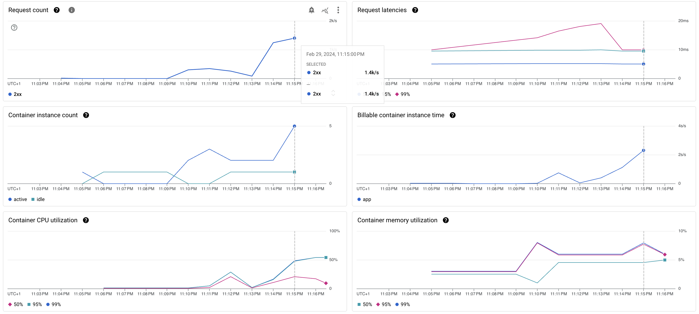

Besom, the Scala SDK for Pulumi, has just had it's second release - the [0.2.x](https://virtuslab.github.io/besom/docs/changelog#020-08-02-2024) series - that focuses on improving the developer experience based on the feedback from early adopters. This release is also the first release marking our march towards the stability of the APIs crafted with awesome developer experience in mind. Before getting into new features and changes let's step back a bit and discuss what Besom really is and why we've built it.

<!--truncate-->

### A wider perspective

Current landscape of software engineering is different in comparison to what it was just a decade ago when Terraform launched but even then the trend towards programmatic management of not only business problems but also software and hardware operations was clearly visible. The space itself was dominated by fragile bash scripting and configuration management DSLs that required additional learning and provided little elasticity. The complexity of software itself grew however as Internet grew ever bigger. It is therefore our opinion that software engineering will evolve to incorporate platform engineering as a first-class citizen - not as a thing that a remote operations teams does but as a natural part of application lifecycle that every developer can easily work with. This merge is already happening with new emergent technologies like [Klotho](https://klo.dev) and [Nitric](https://nitric.io/) but what is first necessary for proliferation of this approach is the common fundamental abstraction of platform resources. 

We believe that [Pulumi](https://pulumi.com) is the solution for Infrastructure as Software (IaS) - a tool like Terraform but much more elastic, much more accessible, composable and developer-friendly. Pulumi can be used from any language that offers a SDK and that's how it marries the ops with the dev - you use the tool that you use to declare resources your application will use and execute on. In the same vein of modern requirements in IT - scalability, robustness, reliability and performance - Scala is a proven contender that keeps evolving to meet new demands. We've felt that the next frontier the scalable language can manage is the domain of platform engineering. For this reason we have joined our forces with Pulumi to first bring Pulumi to JVM with the [Java SDK](https://github.com/pulumi/pulumi-java) and then, based on that experience, built [Besom, the Scala SDK for Pulumi](https://github.com/VirtusLab/besom). Besom is therefore a way to declare and manage infrastructural resources in an idiomatic, functional way using Scala.

I am, personally, of the opinion that code is worth a million words so the best way to show you how easy reliable[^1] cloud engineering becomes with Besom is to just write some code! Quite often what you want to do is to just run your small app somewhere. Let's assume, for the sake of example, that "somewhere" is the Google Cloud Platform's Cloud Run service which is a managed runtime for containerised applications. 

### The App

Let's start with a small web app. To keep things as simple as possible we'll use [scala-cli](https://scala-cli.virtuslab.org/) which will take care of packaging our application for us. We'll also use [tapir's](https://tapir.softwaremill.com/en/latest/server/jdkhttp.html) JDK HTTP server support and leverage Loom because it's just free performance. Let's create a directory for the whole project somewhere and then put our app in `./app` subdirectory. The `project.scala` file will look like this: 

```scala
//> using scala 3.3.3
//> using options -Werror -Wunused:all -Wvalue-discard -Wnonunit-statement

//> using jvm "graalvm-java21:21.0.2"

//> using dep com.softwaremill.sttp.tapir::tapir-jdkhttp-server:1.9.10
//> using dep com.softwaremill.sttp.tapir::tapir-files:1.9.10
//> using dep com.outr::scribe:3.13.0

//> using publish.organization org.virtuslab.besom.example
//> using publish.name app

//> using resourceDir resources
```

The `scala-cli` directives are pretty self-explanatory:
- we use Scala 3.3.3 LTS
- we add some linting options for the compiler
- we select GraalVM CE for JDK 21 as the runtime (because of Loom and because GraalVM is awesome)
- we also pull some dependencies - tapir for http server along with static file serving module and scribe for logging
- we name the project for publishing
- and finally we designate a directory that will contain our resources

The whole app fits in a single file - two endpoints, a HTML snippet as string and a http server definition:
```scala
package org.virtuslab.besom.example

import sttp.tapir.*
import sttp.tapir.server.jdkhttp.*
import sttp.tapir.files.*
import java.util.concurrent.Executors
import sttp.model.HeaderNames

@main def main(): Unit =
  // required by Cloud Run Container runtime contract
  // https://cloud.google.com/run/docs/reference/container-contract
  val host = "0.0.0.0"
  val port = sys.env.get("PORT").flatMap(_.toIntOption).getOrElse(8080)

  // handle index path only
  val indexEndpoint = endpoint.get
    .in("")
    .in(extractFromRequest(_.connectionInfo.remote))
    .in(header[Option[String]](HeaderNames.XForwardedFor))
    .out(htmlBodyUtf8)
    .handle { case (requestHost, xff) =>
      val remote = xff.orElse(requestHost).getOrElse("unknown")
      val forwarded = if xff.isDefined then "forwarded" else "not forwarded"

      scribe.info(s"Received request from $remote ($forwarded) serving index.html...")

      Right(index)
    }

  // serve resources in "static" directory under static/ path
  val staticResourcesEndpoint =
    staticResourcesGetServerEndpoint[Id]("static")(
      // use classloader used to load this application
      classOf[this.type].getClassLoader,
      "static"
    )

  scribe.info(s"Starting server on $host:$port")
  val _ = JdkHttpServer()
    // use Loom's virtual threads to dispatch requests
    .executor(Executors.newVirtualThreadPerTaskExecutor())
    .host(host)
    .port(port)
    .addEndpoint(staticResourcesEndpoint)
    .addEndpoint(indexEndpoint)
    .start()

// html template using tailwind css
val index: String =
  """
  <!DOCTYPE html>
  <html lang="en">
  <head>
    <meta charset="UTF-8">
    <meta name="viewport" content="width=device-width, initial-scale=1.0">
    <link href="https://cdn.jsdelivr.net/npm/tailwindcss@2.2.19/dist/tailwind.min.css" rel="stylesheet">
    <title>Scala 3 app!</title>
  </head>
  <body>
    <div class="flex h-screen w-full justify-center items-center">
      
    </div>
  </body>
  </html>
  """
```

It doesn't do much as you can see as it only solves the hardest problem in web development using tailwind and displays Scala logo centered horizontally and vertically. 

We can check if tailwind did a good job by simply executing one command in the directory storing both files and navigating to `localhost:8080` in browser.

```bash
scala-cli run app
```

If you don't have `scala-cli` on your machine already it is super [easy to fix](https://scala-cli.virtuslab.org/install/), e.g.:
```bash
curl -sSLf https://scala-cli.virtuslab.org/get | sh
```

### Run App, Run!

We have our app and now we need to deploy it "somewhere" using Besom. To [get started](https://virtuslab.github.io/besom/docs/getting_started) we need to install Pulumi:
```bash
curl -fsSL https://get.pulumi.com/ | sh
```

and then install Scala language plugin for Pulumi:

```bash
pulumi plugin install language scala 0.2.2 --server github://api.github.com/VirtusLab/besom
```

Having done that we can initialise a new project:

```bash
mkdir infra && cd infra
```

```bash
pulumi new https://github.com/VirtusLab/besom/tree/v0.2.2/templates/gcp
```

This will launch project builder, ask us some basic questions about how the project will be called, how the initial stack will be called and also what password should be used to encrypt the secrets[^2]. We end up with 4 files inside of `./infra` directory:

* `Main.scala` which contains our infrastructure as Scala code
* `project.scala` which contains `scala-cli` directives
* `Pulumi.yaml` which contains public settings of the project
* `Pulumi.$STACK.yaml` which contains the secrets bound to particular stack where `$STACK` is the name we have provided in the previous step 

To start we will need to add docker support for besom so that we can push our application's image to Google Container Registry (GCR). To do that we need to put these lines into `project.scala`:

```scala
//> using dep "org.virtuslab::besom-docker:4.5.1-core.0.2"
```

Since we want Besom to manage our image building we won't be able to benefit from `scala-cli`'s built-in Docker packaging capabilities but that's actually fine because we would like our Cloud Run app to have the smallest possible footprint possible. To do that we will need to leverage another application packaging capability of `scala-cli` - that of GraalVM native-image building. Besom's Docker integration expects us to provide a `Dockerfile` that will describe how to create the image and that's exactly what we're going to do by putting this content into `./app/Dockerfile`: 

```Dockerfile
FROM --platform=linux/amd64 debian:stable-slim AS build-env

ARG DEBIAN_FRONTEND=noninteractive
RUN --mount=type=cache,target=/var/cache/apt \
    apt-get update  \
    && apt-get install -y curl gzip build-essential libz-dev zlib1g-dev

# Install Scala CLI
ARG SCALA_CLI_VERSION=1.1.2
RUN \
    curl -sSLf https://github.com/VirtusLab/scala-cli/releases/download/v${SCALA_CLI_VERSION}/scala-cli-x86_64-pc-linux.gz | gunzip -c > /usr/local/bin/scala-cli  \
    && chmod +x /usr/local/bin/scala-cli  \
    && /usr/local/bin/scala-cli version

FROM --platform=linux/amd64 build-env AS build
WORKDIR /src
# Copy local code to the container image
COPY . .
# Build a native binary with Scala CLI
ARG GRAALVM_VERSION=21.0.2
RUN \
    --mount=type=cache,target=/root/.cache/coursier \
    /usr/local/bin/scala-cli --power package . \
    --suppress-experimental-feature-warning \
    --server=false \
    --jvm=graalvm-java21:${GRAALVM_VERSION} \
    --native-image \
    --graalvm-jvm-id=graalvm-java21:${GRAALVM_VERSION} \
    --graalvm-args="--static" \
    --graalvm-args="--install-exit-handlers" \
    --graalvm-args="--no-fallback" \
    --graalvm-args="-H:IncludeResources=.*png" \
    --main-class org.virtuslab.besom.example.main -o app -f

FROM --platform=linux/amd64 gcr.io/distroless/static
# Copy the binary to the production image from the builder stage
COPY --from=build /src/app /bin/app

# Run the web service on container startup.
CMD ["/bin/app"]
```

This multi-stage `Dockerfile` will yield a very small final (34.4 MB!) image that will contain only the binary of our app. It also takes care of cross-compilation if necessary.

With this set up we can finally write down infrastructure necessary to deploy our service. Let's clear out our main function's body and start with some basic definitions:

```scala
@main def main = Pulumi.run {
  val project = config.requireString("gcp:project")
  val region  = config.requireString("gcp:region")
  
  val repoName      = p"gcr.io/${project}/${pulumiProject}" // will be automatically created by GCP on docker push
  val appName       = "app"
  val imageFullName = p"${repoName}/${appName}:latest"
  
  Stack.exports(
    dockerImage = imageFullName
  )
```

First we declare that our program needs some values from configuration regarding the GCP project ID and the region to which we want to deploy to. Configuration will be returned as `Output[String]` values which are roughly equal to `IO[String]` (or `Task[String]` if you prefer ZIO)  but we need to interpolate that information to build the image name for GCR. Usually that would involve writing something akin to:

```scala
val imageFullName = project.map { proj =>
  val repoName = s"gcr.io/${proj}/${pulumiProject}"
  val appName = "app"
  s"${repoName}/${appName}:latest"
}    
```

but Besom offers a `p""` / `pulumi""` string interpolator that simplifies this a lot and returns `Output[String]` for us.

Google Cloud Platform requires us to enable services that we wish to use and therefore the first Besom resource that we have to create will be `gcp.projects.Service` that allows us to manage service configuration for the project. We will future-proof it a bit with a small enum and make a small, helpful wrapper for the capabilities that we need:

```scala
  enum GoogleApis(val name: String):
    case CloudRun extends GoogleApis("run.googleapis.com")
    def enableApiKey: NonEmptyString = s"enable-${name.replace(".", "-")}"

  // Enable GCP service(s) for the current project
  val enableServices: Map[GoogleApis, Output[gcp.projects.Service]] = List(
    GoogleApis.CloudRun
  ).map(api =>
    api -> gcp.projects.Service(
      api.enableApiKey,
      gcp.projects.ServiceArgs(
        project = project,
        service = api.name,
        /* if true - at every destroy this will disable the dependent services for the whole project */
        disableDependentServices = true,
        /* if true - at every destroy this will disable the service for the whole project */
        disableOnDestroy = true
      )
    )
  ).toMap
```

For these services to be configured (there's just one for now) we have to make the Stack aware of the necessity their evaluation. We modify the result of our main function then:

```scala
Stack(
  Output.sequence(enableServices.values)
).exports(
  dockerImage = imageFullName
)
```

With this change we can run our Besom project using `pulumi up` in `./infra` directory and Pulumi will be able to enable Cloud Run service for us.

Next step is for Besom to build and push our Docker image for us. This bit is quite straightforwards - we only need to introduce a new import on the top of the file:

```scala
import besom.api.docker
```

and then declare a `docker.Image` resource like this:

```scala
  // Build a Docker image from our Scala app and push it to GCR
  val image = docker.Image(
    "image",
    docker.ImageArgs(
      imageName = imageFullName,
      build = docker.inputs.DockerBuildArgs(
        context = p"../${appName}",
        platform = "linux/amd64" // Cloud Run only supports linux/amd64
      )
    )
  )
```

We provide a full name of the image that we've constructed before, the path to Docker context - our `Dockerfile` in `./app` folder and the platform for which we want the image to be built for. 

Next step is to deploy a Cloud Run service:
```scala
  val service = gcp.cloudrun.Service(
    "service",
    gcp.cloudrun.ServiceArgs(
      location = region,
      name = appName,
      template = gcp.cloudrun.inputs.ServiceTemplateArgs(
        spec = gcp.cloudrun.inputs.ServiceTemplateSpecArgs(
          containers = gcp.cloudrun.inputs.ServiceTemplateSpecContainerArgs(
            image = image.imageName,
            resources = gcp.cloudrun.inputs.ServiceTemplateSpecContainerResourcesArgs(
              limits = Map(
                "memory" -> "1Gi"
              )
            )
          ) :: Nil
        )
      )
    ),
    opts(dependsOn = enableServices(GoogleApis.CloudRun))
  )
```

This is a bit more involved as there are more properties to configure:
* we pass information about the region in which this deployment should happen in
* we set up the name of the Cloud Run service - `app`
* we then specify that we want to use our container with 1 GB of RAM

One important thing here is that we pass a resource option declaring that this resource has to be created only after Cloud Run service is enabled. Pulumi is parallel by default not to choke on relatively slow cloud provider APIs and therefore some sequential relationships between resources require a manual setup of the dependency in the evaluation graph. This is not necessary when an output value of one resource is used as an input for another but in this case we have to give Pulumi a small hint.

Finally, we have to inform GCP that we want anyone to be able to reach our application from the internet by configuring an IAM member resource:

```scala
  // Open the service to public unrestricted access
  val serviceIam = gcp.cloudrun.IamMember(
    "service-iam-everyone",
    gcp.cloudrun.IamMemberArgs(
      location = service.location,
      service = service.name,
      role = "roles/run.invoker",
      member = "allUsers"
    )
  )
```

The last thing to do is to add the URL of our app to Stack's exports and add the IAM member to dependencies of our Stack:

```scala
Stack(
  Output.sequence(enableServices.values),
  serviceIam
).exports(
  dockerImage = imageFullName,
  // Export the DNS name of the service
  serviceUrl = service.statuses.map(_.headOption.map(_.url)) 
)
```

After this step we can run:

```bash
pulumi up
```

in our `./infra` directory and let Pulumi handle all the heavy lifting. After a while we will see an output:

```
Please choose a stack, or create a new one: dev
Previewing update (dev):
     Type                       Name                       Plan
 +   pulumi:pulumi:Stack        gcp-cloudrun-dev           create
 +   ├─ gcp:projects:Service    enable-run-googleapis-com  create
 +   ├─ docker:index:Image      image                      create
 +   ├─ gcp:cloudrun:Service    service                    create
 +   └─ gcp:cloudrun:IamMember  service-iam-everyone       create

Outputs:
    dockerImage: "gcr.io/redacted-redacted/gcp-cloudrun/app:latest"
    serviceUrl : output<string>

Resources:
    + 5 to create

Do you want to perform this update? yes
Updating (dev):
     Type                       Name                       Status
 +   pulumi:pulumi:Stack        gcp-cloudrun-dev           created (276s)
 +   ├─ gcp:projects:Service    enable-run-googleapis-com  created (4s)
 +   ├─ docker:index:Image      image                      created (166s)
 +   ├─ gcp:cloudrun:Service    service                    created (109s)
 +   └─ gcp:cloudrun:IamMember  service-iam-everyone       created (4s)

Outputs:
    dockerImage: "gcr.io/redacted-redacted/gcp-cloudrun/app:latest"
    serviceUrl : "https://app-kdthccbreq-lm.a.run.app"

Resources:
    + 5 created

Duration: 4m44s
```

We can now copy the output of `serviceUrl` property to the browser and enjoy our new app being live!

Cloud Run offers some nice observability features from the start so let's generate some traffic to see that everything is about right:

```bash
wrk -t5 -c25 -d120s https://app-kdthccbreq-lm.a.run.app
```

```
Running 2m test @ https://app-kdthccbreq-lm.a.run.app
  5 threads and 25 connections
  Thread Stats   Avg      Stdev     Max   +/- Stdev
    Latency    17.68ms   10.49ms 455.92ms   98.89%
    Req/Sec   284.36     38.99   350.00     92.98%
  165617 requests in 2.00m, 112.77MB read
  Socket errors: connect 0, read 0, write 0, timeout 24
Requests/sec:   1379.24
Transfer/sec:      0.94MB
```

And that's how it looks in the GCP Console:



To clean up we can simply run:

```bash
pulumi destroy
```

and all resources registered with the stack will be removed: 

``` 
Please choose a stack: dev
Previewing destroy (dev):
     Type                       Name                       Plan
 -   pulumi:pulumi:Stack        gcp-cloudrun-dev           delete
 -   ├─ gcp:cloudrun:IamMember  service-iam-everyone       delete
 -   ├─ gcp:cloudrun:Service    service                    delete
 -   ├─ gcp:projects:Service    enable-run-googleapis-com  delete
 -   └─ docker:index:Image      image                      delete

Outputs:
  - dockerImage: "gcr.io/besom-413811/gcp-cloudrun/app:latest"
  - serviceUrl : "https://app-kdthccbreq-lm.a.run.app"

Resources:
    - 5 to delete

Do you want to perform this update? yes
Destroying (dev):
     Type                       Name                       Status
 -   pulumi:pulumi:Stack        gcp-cloudrun-dev           deleted (0.00s)
 -   ├─ gcp:cloudrun:IamMember  service-iam-everyone       deleted (5s)
 -   ├─ gcp:cloudrun:Service    service                    deleted (0.13s)
 -   ├─ gcp:projects:Service    enable-run-googleapis-com  deleted (12s)
 -   └─ docker:index:Image      image                      deleted (0.00s)

Outputs:
  - dockerImage: "gcr.io/besom-413811/gcp-cloudrun/app:latest"
  - serviceUrl : "https://app-kdthccbreq-lm.a.run.app"

Resources:
    - 5 deleted

Duration: 19s

The resources in the stack have been deleted, but the history and configuration associated with the stack are still maintained.
If you want to remove the stack completely, run `pulumi stack rm dev`.
```

Fun part about this is that it's just as easy to set things up using any other cloud provider, even the smaller and less popular ones. Besom's provider library includes all (since 0.2.0) publicly available [Pulumi providers](https://www.pulumi.com/registry/) and [counts around 150 integrations](https://central.sonatype.com/search?q=besom&sort=published) at the moment. 

The full code for this app can be found [here](https://github.com/VirtusLab/besom-scala-on-cloudrun).

This sample application has been adapted from our library of examples available [here](https://github.com/VirtusLab/besom/tree/release/v0.2.2/examples) - we invite you to check out others as well. While waiting anxiously to see what you build with Besom we'll keep ourselves busy improving the developer experience even further and delivering the [Automation API](https://www.pulumi.com/automation/). 


[^1]: I know you can just set things up in the console of your cloud provider but common experience proves that this approach works for about a week or month and then the decay sets in and after a while someone deletes prod by accident

[^2]: **important**, always provide a good password here, it's used to encrypt secrets so that you can store them in your git repo