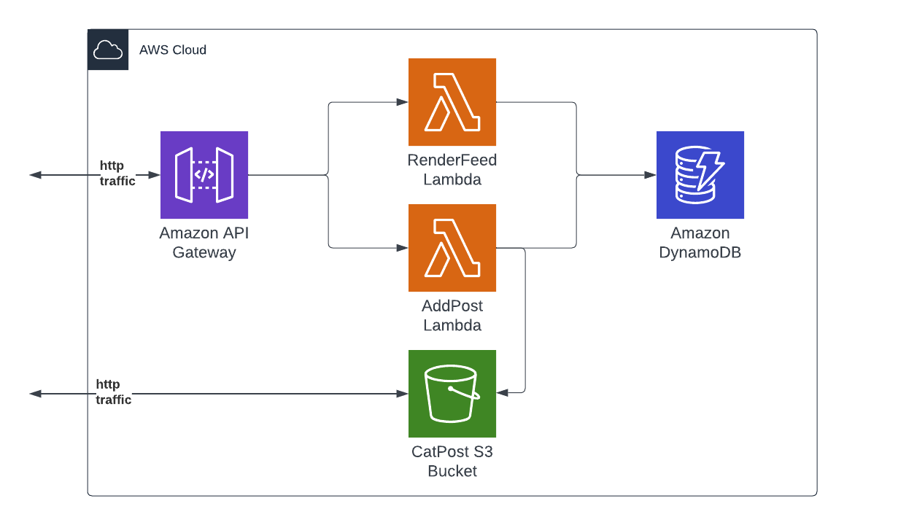

## Introduction
---

Besom, the Pulumi SDK for Scala allows you to create, deploy and manage cloud resources such as databases, serverless
functions and services quickly and safely. In this tutorial your will do exactly that - you will deploy a very basic 
yet functional serverless application built in Scala 3. The target environment will be 
[Amazon Web Services](https://aws.amazon.com/). Everything covered in this tutorial fits into the free tier so the only requirement is to 
actually have an AWS account. You can [create one here](https://portal.aws.amazon.com/billing/signup) if you don't have one.

To start first install all the necessary tools mentioned in [Getting started](./getting_started.md) section.

You will also need to obtain **AWS Access Key ID** and **AWS Secret Access Key** from IAM Console. Once you have them,
install [the AWS CLI](https://aws.amazon.com/cli/) for your platform and perform 
```bash
aws configure
```

This will set up your AWS access for use with Pulumi.

:::caution
It's **strongly** recommended that you use an IAM account with **AdministratorAccess** permissions as it guarantees that 
you won't encounter issues related to missing permissions. Additionally, it's also recommended to set your 
[default region](https://docs.aws.amazon.com/awsconsolehelpdocs/latest/gsg/select-region.html) in AWS Console.
:::

:::tip
After running `aws configure` it's a good idea to run: 
```bash
aws sts get-caller-identity
``` 
This allows you to check that everything is fine! 

If it is you should see a JSON containing your user id, AWS account number and 
your user's ARN.
:::

After all of that is done the last step is to clone the [tutorial repository](https://github.com/VirtusLab/besom-tutorial):

```bash
git clone git@github.com:VirtusLab/besom-tutorial.git && cd besom-tutorial
```

Repository contains the sources for AWS Lambda app built with Scala 3. The application itself is already prepared for you,
you don't have to write it from scratch. Moreover, the app is built with GraalVM Native-Image so the build result is a 
native binary allowing for very fast cold starts and miniscule resource use. 

Sources of the app reside in the `./lambda` directory.

You can build the application yourself using the provided `./build.sh` script **if you're running on Linux with AMD64 
processor architecture**. Unfortunately GraalVM does not support compilation of native images for architectures different 
than the one that you are using. For all users on Macs and Windows (and Linux users on ARM platforms) we have provided pre-built artifacts, 
already packaged into zip files.

These artifacts can be found in `./pre-built/` directory of the repository.

## Architecture
---

The application you are going to deploy to AWS is called CatPost. It's a simple app from simpler times - its only 
functionality is for the cat lovers to post pictures of their cats along with their names and comments regarding 
the picture.

Here's a chart describing the infrastructure of the application:



The app consists of two AWS Lambdas reachable on a public endpoint of Amazon API Gateway. The data about posts is held
in a DynamoDB table and the pictures of cats are stored in a publicly available AWS S3 bucket. First lambda renders the
page with post feed, second handles creation of new posts, uploads data to S3 and DynamoDB.
Ok, let's deploy!

## Infrastructure-as-Scala-code
---

Your infrastructure will live inside the `./besom` directory. Once you open the directory in your IDE (remember: 
`scala-cli setup-ide .`) you will notice that there are 3 files there:

* `project.scala` - [Scala-CLI project definition](https://scala-cli.virtuslab.org/docs/guides/using-directives/)
* `Pulumi.yaml` - [Pulumi project definition](https://www.pulumi.com/docs/concepts/projects/project-file/)
* `Main.scala` - the actual Pulumi program written in Scala using Besom

Go ahead and open the `Main.scala` file. Inside you will see this snippet:
```scala
import besom.*

@main def main: Unit = Pulumi.run {
  val warning = log.warn("Nothing's here yet, it's waiting for you to write some code!")
  
  Stack(warning)
}
```

To learn more about projects and programs in Besom refer to the [Projects section of the Basics page](./basics.md#projects).

This is the minimal Besom program that doesn't do anything beside logging a message. Let's change that and add some
AWS components! 

## AWS S3 Bucket
---

The first step that you are going to do is to set up data storage for our app. The most important part of application
for cat lovers is a place to store pictures of cats, so we'll start with an AWS S3 bucket. AWS S3 is a data storage 
service that allows users to perform all operations using HTTP interface. This is great for this app because you can 
just use the bucket as a file server that will serve pictures of cats to whomever requires them. Let's start with 
the definition of a bucket:

```scala
import besom.api.aws.* // place this on top of the file

// place this inside of the `Pulumi.run` scope
val feedBucket = s3.Bucket(
  "pulumi-catpost-cat-pics",
  s3.BucketArgs(
    forceDestroy = true // without this Pulumi won't delete the bucket on destroy
  )
)
```

You still need to add this resource to program's main flow so change this:

```scala
val warning = log.warn("Nothing's here yet, it's waiting for you to write some code!")

Stack(warning)
```

into this:

```scala
Stack(feedBucket)
```

Simple enough. Notice that what is done here is that you provide a name for Pulumi resource, not a name for the bucket
itself! You could provide a name for this bucket like this:

```scala
val feedBucket = s3.Bucket(
  "pulumi-catpost-cat-pics",
  s3.BucketArgs(
    bucket = "pulumi-catpost-cat-pics"
  )
)
```

### Resource names, identifiers and URNs

Since bucket names in AWS are **globally unique**, it would be very easy to have a name clash with 
another user. When you omit the explicit name of a resource via it's resource arguments Pulumi uses the name of Pulumi 
resource and suffixes it with a random string to generate a unique name (auto-name). This distinction is quite important 
because Pulumi resource name is a part of [Pulumi URN](https://www.pulumi.com/docs/concepts/resources/names/), but the actual bucket name is a part of its resource ID in AWS infrastructure.
To learn more please refer to the [Resources section of the Basics page](./basics.md#resources).

For now let's just remember that first
argument of Besom resource constructor function is always the Pulumi resource name and resource names for cloud 
provider to use are always provided via resource arguments.

### Create the resources stack

You can try and create your bucket now. To do this execute `pulumi up` in `./besom` directory: 
```bash
cd besom
pulumi up
```

Pulumi will ask you to create a [stack](https://www.pulumi.com/docs/concepts/stack/). Name it however you want, we named it `dev` because
stacks commonly match application environments. You might be also asked to provide a password for this stack. This is 
actually quite important because Pulumi uses that password to encrypt sensitive data related to your deployment. As 
you are just playing you can use an empty password, but it's *very important* to use a proper password for actual work.
Pulumi will subsequently print a preview of changes between current state of affairs and the changes your code will 
introduce to the cloud environment. To learn more about stacks refer to the [Stacks section of the Basics page](./basics.md#stacks)

Select `yes` when asked whether you want to deploy this set of changes to cloud.

To work faster you can also use these shorthand commands:
* `pulumi up --stack dev -y` - tells Pulumi to use stack named `dev` and not to ask for confirmation of deployment 
after preview
* `pulumi destroy --stack dev -y` - tells Pulumi to **destroy** the infrastructure in stack named `dev` without asking 
for confirmation

Remember that in actual production environment you can't just `pulumi destroy` things. Since we're just trying things 
out it will be handy however because it's a tutorial. If you get into any trouble you can just start over by 
destroying everything and then applying your program from ground up.

### Make the bucket public

There's one huge problem with our bucket now - all S3 buckets are private by default. Let's make it public. 

Making an S3 bucket public is quite involved because turning a private bucket public can deal an enormous amount of damage
to a company. To achieve this you will need to create two new resources - a `BucketPublicAccessBlock` and a `BucketPolicy`.
This will also allow us to introduce two new concepts.

Here's the code necessary to create a `BucketPublicAccessBlock`:

```scala
val bucketName = feedBucket.bucket

val feedBucketPublicAccessBlock = bucketName.flatMap { name =>
  s3.BucketPublicAccessBlock(
    s"${name}-publicaccessblock",
    s3.BucketPublicAccessBlockArgs(
      bucket = feedBucket.id,
      blockPublicPolicy = false // Do not block public bucket policies for this bucket
    )
  )
}
```

First new thing is that the `bucket` property of a bucket is used here via [lifting](./lifting.md). You need the name
of the bucket that was actually created in AWS because it's a unique name generated in runtime. Next step is to use
that name by `flatMap`ping on the `Output[String]` value of the `bucket` property to name the `BucketPublicAccessBlock` resource via string interpolation. Then the actual cloud identifier is passed via `BucketPublicAccessBlockArgs` to let 
AWS know which bucket this public access block regards. Finally `blockPublicPolicy` property is set to `false` to allow
for assignment of the `PublicReadGetObject` policy. Speaking of policy - here's the next snippet:

```scala
import spray.json.* // place this on top of the file

val feedBucketPolicy = bucketName.flatMap(name =>
  s3.BucketPolicy(
    s"${name}-access-policy",
    s3.BucketPolicyArgs(
      bucket = feedBucket.id,
      policy = JsObject(
        "Version" -> JsString("2012-10-17"),
        "Statement" -> JsArray(
          JsObject(
            "Sid" -> JsString("PublicReadGetObject"),
            "Effect" -> JsString("Allow"),
            "Principal" -> JsObject(
              "AWS" -> JsString("*")
            ),
            "Action" -> JsArray(JsString("s3:GetObject")),
            "Resource" -> JsArray(JsString(s"arn:aws:s3:::${name}/*"))
          )
        )
      ).prettyPrint
    ),
    opts(
      dependsOn = feedBucketPublicAccessBlock
    )
  )
)
```

First of all, the dynamically generated unique bucket name is used again to name this resource too, and then 
its ID is used once more to inform `BucketPolicy` about the bucket it should be applied to. 

The policy itself is expressed here using JSON AST of [spray-json](https://github.com/spray/spray-json) library and rendered to string. 
Alternatively, it could be just an interpolated string literal, it could also be loaded from a file 
and interpolated using regular expression. 

The last new step is the use of `dependsOn` property of [resource options](https://www.pulumi.com/docs/concepts/options/). We use it here to inform Pulumi about the
necessity of ordered creation of resources - the `BucketPublicAccessBlock` with `blockPublicPolicy = false` 
has to be created before a public policy is actually applied to the bucket. Should we allow Pulumi to run 
everything in parallel AWS API would return a `403 Forbidden` error. More about this topic can be found in
[Resource constructors, outputs and asynchronicity](./constructors.md) section of the docs.

Please don't forget to add both resources to your `Stack`:
```scala
Stack(feedBucket, feedBucketPublicAccessBlock, feedBucketPolicy)
```

If you run your program now you will have an empty but publicly accessible S3 bucket!

## DynamoDB Table
---

In scope of the lambda app at `./lambda/dynamodb.scala` you can find the case class used to model a row of
data in AWS DynamoDB. It looks like this:
```scala
case class CatPost(
  entryId: String,
  userName: String,
  comment: String,
  timestamp: String,
  catPictureURL: String
)
```

[DynamoDB](https://aws.amazon.com/dynamodb/) is a NoSQL database so there's no column schema so to speak to create. 
CatPost is however in need of a way to sort the entries to display them in correct order - from oldest to newest. 
This means that DynamoDB table will have to have both a hash key and range key that will use the `timestamp` attribute. 

Here's how you can define such table using Besom:

```scala
import besom.api.aws.dynamodb.inputs.* // place this on top of the file

val catPostTable = dynamodb.Table(
  "pulumi-catpost-table",
  dynamodb.TableArgs(
    attributes = List(
      TableAttributeArgs(
        name = "PartitionKey",
        `type` = "S"
      ),
      TableAttributeArgs(
        name = "timestamp",
        `type` = "S"
      )
    ),
    hashKey = "PartitionKey",
    rangeKey = "timestamp",
    readCapacity = 5,
    writeCapacity = 5
  )
)
```

That's all! DynamoDB is that easy to set up. Add the resource to the final `Stack` and run it.

## AWS Lambdas

Ok, now you're getting to the point. You will now deploy both [AWS Lambdas](https://aws.amazon.com/lambda/). 
For lambdas to run they have to have a correct set of permissions aggregated as an AWS IAM Role. 
Let's start with creation of a Role that will allow lambdas to manipulate DynamoDB, S3 and run in Lambda runtime:

```scala
val lambdaRole = iam.Role("lambda-role", iam.RoleArgs(
  assumeRolePolicy = JsObject(
    "Version" -> JsString("2012-10-17"),
    "Statement" -> JsArray(
      JsObject(
        "Action" -> JsString("sts:AssumeRole"),
        "Effect" -> JsString("Allow"),
        "Principal" -> JsObject(
          "Service" -> JsString("lambda.amazonaws.com")
        )
      )
    )
  ).prettyPrint,
  forceDetachPolicies = true, // just so that pulumi destroy works correctly
  managedPolicyArns = List(
    "arn:aws:iam::aws:policy/service-role/AWSLambdaBasicExecutionRole",
    "arn:aws:iam::aws:policy/AmazonDynamoDBFullAccess",
    "arn:aws:iam::aws:policy/AmazonS3FullAccess",
  )
))
```

Now that there's a Role it's time to deploy the Lambdas:

```scala
import besom.api.aws.lambda.inputs.* // place this on top of the file
import besom.types.Archive.FileArchive // place this on top of the file

val stageName: NonEmptyString = "default"

val feedLambda = lambda.Function(
  "pulumi-render-feed",
  lambda.FunctionArgs(
    role = lambdaRole.arn,
    runtime = "provided.al2", // Use the custom runtime
    code = FileArchive("../pre-built/render-feed.zip"),
    handler = "whatever", // we don't use the handler, but it's required
    environment = FunctionEnvironmentArgs(
      variables = Map(
        "STAGE" -> stageName,
        "BUCKET_NAME" -> bucketName,
        "DYNAMO_TABLE" -> catPostTable.name
      )
    )
  )
)

val addLambda = lambda.Function(
  "pulumi-add-post",
  lambda.FunctionArgs(
    role = lambdaRole.arn,
    runtime = "provided.al2", // Use the custom runtime
    code = FileArchive("../pre-built/post-cat-entry.zip"),
    handler = "whatever", // we don't use the handler, but it's required
    environment = FunctionEnvironmentArgs(
      variables = Map(
        "STAGE" -> stageName,
        "BUCKET_NAME" -> bucketName,
        "DYNAMO_TABLE" -> catPostTable.name
      )
    )
  )
)
```

Let's talk about what've just happened. First thing is the stage name. This parameter is actually required later by the 
AWS API Gateway, but it's defined here so that self-URLs can be properly resolved in Lambdas. 
We pass the stage name to the lambda via environment variables. 
Lambda definitions take few arguments: 
- a reference to the Role created above (`lambdaRole`), 
- a parameter defining which Lambda runtime should be used - we're using [the new custom runtime](https://docs.aws.amazon.com/lambda/latest/dg/runtimes-custom.html#runtimes-custom-use) 
for our GraalVM native binary, a set of environment variables to configure the app
- and a `FileArchive` pointing to where the prepared Zip package with the native binary of Lambda exists. 
The path is relative and points to pre-built packages by default.

If you chose to rebuild the lambdas on your own you have to adjust the path so that it points to the relevant packages.

Add this to your program, add both lambdas to the `Stack` at the end of your program, run `pulumi up` and that's it, AWS Lambdas deployed.

## AWS API Gateway

Last thing to do - you have to make your app accessible from the Internet. To do this you have to deploy 
[API Gateway](https://aws.amazon.com/api-gateway/) with a correct configuration. 

Let's start with the API itself:
```scala
import besom.api.aws.apigateway.inputs.* // place this on top of the file

val api = apigateway.RestApi(
  "api",
  apigateway.RestApiArgs(
    binaryMediaTypes = List("multipart/form-data"),
    endpointConfiguration = RestApiEndpointConfigurationArgs(types = "REGIONAL")
  )
)
```

This creates an API that will be able to properly transmit multipart HTTP requests (cat pictures!) to the `addPost` lambda. 

Next, the API needs permissions to invoke the lambdas:

```scala
val feedLambdaPermission = lambda.Permission(
  "feedLambdaPermission",
  lambda.PermissionArgs(
    action = "lambda:InvokeFunction",
    function = feedLambda.name,
    principal = "apigateway.amazonaws.com",
    sourceArn = p"${api.executionArn}/*"
  )
)

val addLambdaPermission = lambda.Permission(
  "addLambdaPermission",
  lambda.PermissionArgs(
    action = "lambda:InvokeFunction",
    function = addLambda.name,
    principal = "apigateway.amazonaws.com",
    sourceArn = p"${api.executionArn}/*"
  )
)
```

Next - routing configuration for the API:
```scala
val feedMethod = apigateway.Method(
  "feedMethod",
  apigateway.MethodArgs(
    restApi = api.id,
    resourceId = api.rootResourceId,
    httpMethod = "GET",
    authorization = "NONE"
  )
)

val addResource = apigateway.Resource(
  "addResource",
  apigateway.ResourceArgs(
    restApi = api.id,
    pathPart = "post",
    parentId = api.rootResourceId
  )
)

val addMethod = apigateway.Method(
  "addMethod",
  apigateway.MethodArgs(
    restApi = api.id,
    resourceId = addResource.id,
    httpMethod = "POST",
    authorization = "NONE"
  )
)
```

Now you have to configure the API Gateway to integrate with AWS Lambda properly:

```scala
val feedIntegration = apigateway.Integration(
  "feedIntegration",
  apigateway.IntegrationArgs(
    restApi = api.id,
    resourceId = api.rootResourceId, // use / path
    httpMethod = feedMethod.httpMethod,
    // must be POST, this is not a mistake: https://repost.aws/knowledge-center/api-gateway-lambda-template-invoke-error
    integrationHttpMethod = "POST",
    `type` = "AWS_PROXY", // Lambda Proxy integration
    uri = feedLambda.invokeArn
  )
)

val addIntegration = apigateway.Integration(
  "addIntegration",
  apigateway.IntegrationArgs(
    restApi = api.id,
    resourceId = addResource.id, // use /post path
    httpMethod = addMethod.httpMethod,
    // must be POST, this is not a mistake: https://repost.aws/knowledge-center/api-gateway-lambda-template-invoke-error
    integrationHttpMethod = "POST",
    `type` = "AWS_PROXY", // Lambda Proxy integration
    uri = addLambda.invokeArn
  )
)
```

Now we have one more thing to do, create API Gateway account settings (region wide) and associate it with the API:

```scala
val cloudwatchRole = iam.Role(
  "cloudwatchRole",
  iam.RoleArgs(
    assumeRolePolicy = """{
        |  "Version": "2012-10-17",
        |  "Statement": [
        |    {
        |      "Effect": "Allow",
        |      "Action": "sts:AssumeRole",
        |      "Principal": {
        |        "Service": [
        |           "apigateway.amazonaws.com"
        |        ]
        |      }
        |    }
        |  ]
        |}
        |""".stripMargin.parseJson.prettyPrint,
    managedPolicyArns = List(
      "arn:aws:iam::aws:policy/service-role/AmazonAPIGatewayPushToCloudWatchLogs"
    )
  )
)

val cloudwatchRolePolicy = iam.RolePolicy(
  "cloudwatchRolePolicy",
  iam.RolePolicyArgs(
    role = cloudwatchRole.id,
    policy = """{
        |  "Version": "2012-10-17",
        |  "Statement": [
        |    {
        |      "Effect": "Allow",
        |      "Action": [
        |        "logs:CreateLogGroup",
        |        "logs:CreateLogStream",
        |        "logs:DescribeLogGroups",
        |        "logs:DescribeLogStreams",
        |        "logs:PutLogEvents",
        |        "logs:GetLogEvents",
        |        "logs:FilterLogEvents"
        |      ],
        |      "Resource": "*"
        |    }
        |  ]
        |}
        |""".stripMargin.parseJson.prettyPrint
  )
)

val apiAccount = apigateway.Account(
  "apiAccount",
  apigateway.AccountArgs(
    cloudwatchRoleArn = cloudwatchRole.arn
  )
)
```

:::caution
As there is no API method for deleting account settings or resetting it to defaults, 
destroying this resource will keep your account settings intact!
:::

Finally, you have to create a deployment of the API with its stage (here's where we reuse the `stageName` value from
Lambdas section):

```scala
val apiDeployment = apigateway.Deployment(
  "apiDeployment",
  apigateway.DeploymentArgs(
    restApi = api.id,
    // workarounds for the underlying provider bugs
    triggers = Map(
      "resourceId" -> api.rootResourceId,
      "feedMethodId" -> feedMethod.id,
      "feedIntegrationId" -> feedIntegration.id,
      "addResourceId" -> addResource.id,
      "addMethodId" -> addMethod.id,
      "addIntegrationId" -> addIntegration.id,
    )
  ),
  opts(
    dependsOn = List(feedLambda, addLambda),
    deleteBeforeReplace = false
  )
)

val apiStage = apigateway.Stage(
  "apiStage",
  apigateway.StageArgs(
    restApi = api.id,
    deployment = apiDeployment.id,
    stageName = stageName
  ),
  opts(
    deleteBeforeReplace = true
  )
)

val apiStageSettings = apigateway.MethodSettings(
  "apiStageSettings",
  apigateway.MethodSettingsArgs(
    restApi = api.id,
    stageName = apiStage.stageName,
    methodPath = "*/*",
    settings = MethodSettingsSettingsArgs(
      metricsEnabled = true,
      loggingLevel = "ERROR"
    )
  ),
  opts(
    dependsOn = apiAccount
  )
)
```

Two things that need attention here is that API deployment has to be sequenced with Lambdas and IAM creation so the
`dependsOn` property is used again. Another thing is that 
[`deleteBeforeReplace` resource option](https://www.pulumi.com/docs/concepts/options/deletebeforereplace/) makes an appearance. 
These are necessary for AWS to correctly handle the deployment of these resources.

## Export stack outputs

Ok, that's it. Add *all* of these resources to Stack and then modify
the [`exports`](./exports.md) so that it matches this:
```scala
Stack(...).exports(
  feedBucket = feedBucket.bucket,
  endpointURL = apiStage.invokeUrl
)
```
This allows you to see both the dynamic, partially random name of the S3 bucket that has been created and also 
the public URL under which your CatPost instance is available. 

You can access your stack outputs at any time using `pulumi stack output` command, e.g.:
```
Current stack outputs (2):
    OUTPUT       VALUE
    endpointURL  https://***.execute-api.eu-central-1.amazonaws.com/default
    feedBucket   pulumi-catpost-cat-pics-***
```

**Visit it now and post some cats!**

<br/><br/>

## Addendum A - debugging

If you run into problems with CatPost lambdas when hacking on this tutorial you might want to create Cloudwatch 
`LogGroup`s for them so that you can track what's in their logs:

```scala
val feedLambdaLogs = feedLambda.name.flatMap { feedName => 
  val feedLambdaLogsName: NonEmptyString = s"/aws/lambda/$feedName"

  cloudwatch.LogGroup(
    feedLambdaLogsName,
    cloudwatch.LogGroupArgs(
      name = feedLambdaLogsName,
      retentionInDays = 3
    )
  )
}

val addLambdaLogs = addLambda.name.flatMap { addName => 
  val addLambdaLogsName: NonEmptyString = s"/aws/lambda/$addName"

  cloudwatch.LogGroup(
    addLambdaLogsName,
    cloudwatch.LogGroupArgs(
      name = addLambdaLogsName,
      retentionInDays = 3
    )
  )
}
```
Again, remember to add them to the Stack at the end of the program.

## Addendum B - final `Stack` block

Here's how the final `Stack` block looks like in a complete deployment:
```scala
Stack(
  feedBucket, 
  feedBucketPolicy, 
  feedBucketPublicAccessBlock,
  catPostTable,
  feedLambdaLogs, 
  addLambdaLogs,
  feedLambda,
  addLambda,
  api,
  feedLambdaPermission,
  addLambdaPermission,
  feedMethod,
  addResource,
  addMethod,
  feedIntegration,
  addIntegration,
  apiDeployment,
  apiStage,
  apiAccount,
  apiStageSettings,
  cloudwatchRolePolicy
).exports(
  feedBucket = feedBucket.bucket,
  endpointURL = apiStage.invokeUrl
)
```

## Addendum C - complete branch

If you run into problems during your tutorial run be sure to check out the `complete` branch of the 
[`besom-tutorial` repo](https://github.com/VirtusLab/besom-tutorial).
It contains a complete, tested draft of the infrastructure you are tasked to prepare here.
